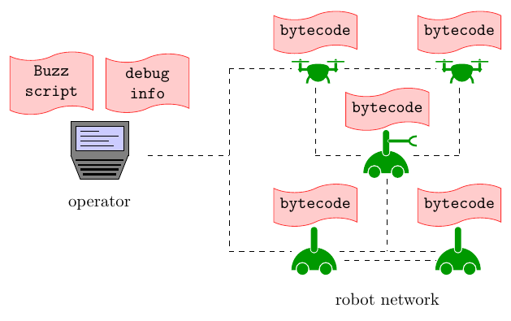
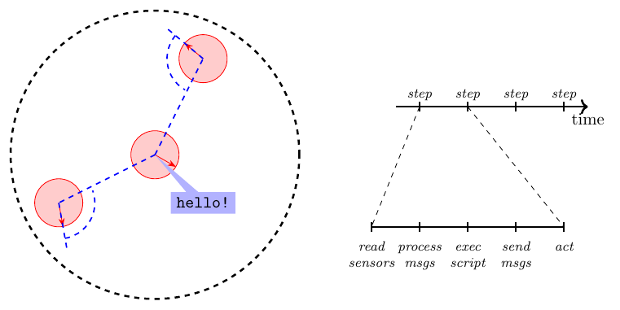

# Basic Buzz Concepts

## Development, Compilation, and Deployment of Buzz Scripts

### Dynamic extension language
Buzz is a [dynamic language](https://en.wikipedia.org/wiki/Dynamic_programming_language) that allows one to express complex swarm behaviors with concise scripts. Buzz is designed as an *extension language*. The task of an extension language is to allow the programmer to work at a higher level of abstraction with respect to that of the underlying system. Thanks to its [C interface](../integration.org), Buzz can be used with any kind of robot software that can interoperate with C or C++. This makes it very simple to install Buzz on practically any existing robot, and also integrate it with frameworks such as [Robot Operating System](http://www.ros.org/).



### Bytecode and BVM
A Buzz script is compiled through the [[buzz_toolset#bzzc|bzzc]] compiler into bytecode. The bytecode is then uploaded on each robot in the swarm, and executed by every robot individually. The execution is performed by the [Buzz Virtual Machine (BVM)](../concepts/vm.md), which is installed on every robot in the swarm.

### Debugging
In principle, once the code is uploaded on the robot and the experiment is running, the robots do not need an operator to keep going. However, it is always the case that an operator either needs or wants to monitor the progress of a swarm. For instance, when an error occurs, the operator might want to inspect the state of the robot that experienced the error. Differently from many existing languages, the Buzz bytecode does not contain any debugging symbols. Instead, the debugging symbols are generated by [bzzc](../toolset.md#bzzc) as a separate file, and must be used by the operator to analyze the cause of an error. The separation of bytecode and debugging symbols spares memory on the (often resource-limited) robots.

### Using Buzz
To develop and debug Buzz scripts, a simple starting point is to employ the [ARGoS simulator](http://www.argos-sim.info). An integration guide is provided [here](../argos-integration.md). Integration with other simulators and real robots is currently ongoing.

## A Swarm as a Programmable Machine



### Discrete swarm
A swarm is seen as a discrete collection of robots. Each robot independently executes the BVM and the uploaded copy of the bytecode. In the current implementation of Buzz, the bytecode must be the same for every robot (i.e., the robots execute the same script).

### Step-wise execution
The execution of a script proceeds in *steps*. The time length of a step is defined by the designer who installs Buzz on a robot. Each step is composed of a number of phases: sensor reading, received message processing, execution of a portion of script, message broadcast, and actuation. The length of a step must be chosen so that all phases terminate before the next step is to be started.

### Communication model
The robots are assumed capable of exchanging information through *situated communication*. Situated communication is a form of gossip-based information exchange in which, upon receiving a message, a robot is capable of estimating the relative location of the message source. Situated communication is instrumental to many basic swarm behaviors such as pattern formation, flocking, segregation, and chain formation.

## A Typical Buzz Script

The [Buzz syntax](../technical-specifications/syntax.md) is inspired by well-known languages such as [JavaScript](https://www.javascript.com/), [Python](https://www.python.org/), and [Lua](http://www.lua.org/) and is detailed in the [Buzz API](../api.org).

In principle, a Buzz script can be organized in any way one likes. Typically, however, a number of standard functions are present, because they need to be called by the underlying system to proceed with the execution. These functions take care of initialization, memory cleanup, reset, and stepping. To ensure standardization across different robots, it is considered standard to include into a Buzz script at least these four functions as shown below.

```
# Executed once at init time.
function init() {
   ...
}

# Executed at each time step.
function step() {
   ...
}

# Executed once when the robot (or the simulator) is reset.
function reset() {
   ...
}

# Executed once at the end of experiment.
function destroy() {
   ...
}
```
