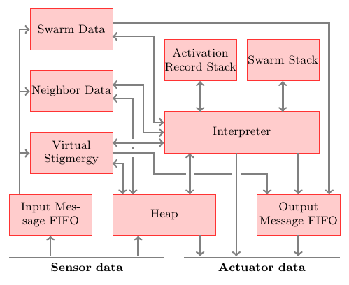

# The Buzz Virtual Machine

The purpose of the Buzz Virtual Machine (BVM) is to collect sensor data, process incoming messages, execute a portion of the uploaded bytecode, apply values to the robot's actuators, and send messages to nearby robots. As shown in the picture below, to perform these tasks the BVM is formed by a number of interconnected components.

## Information Flow
The sensor data and the incoming messages are collected through the robot C API. It is the task of the designer who integrates the BVM with a specific robot to map sensor values to Buzz primitives (e.g., through tables and variables) and to pass incoming messages to the BVM input queue. Once this is done, the other components of the BVM crunch the data and produce an output. The output can be exported in two possible ways: through variables or through function calls. Again, it is the task of the designer to decide whether it makes more sense that a certain robot feature is mapped to a Buzz variable or to a function call. For more information see [Integration with C/C++](../integration.md).

## The Stacks
The BVM is a [stack-based machine](https://en.wikipedia.org/wiki/Stack_machine). This means that the computation proceeds by manipulating a stack. Each [operation](../technical-specifications/assembler.md) either adds elements to the stack, or removes them, or substitutes them with different ones. Internally, Buzz actually manages a *stack of stacks*. Each stack corresponds to a function call. Upon calling a function, a dedicated stack is pushed and the function is executed; upon exiting from a function, the corresponding stack is popped and the execution proceeds with the caller code. The reason why multiple stacks are used is twofold:
* The BVM uses [closures](https://en.wikipedia.org/wiki/Closure_(computer_programming)) to support functions as first-class language objects;
* Swarm management is achieved through dedicated stacks.
