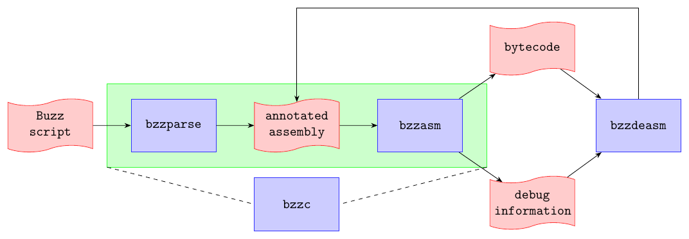

# Buzz Toolset



The most common use of the Buzz toolset is to compile a Buzz script into bytecode executable by the [Buzz Virtual Machine](concepts/vm.md). As shown in the above image, the process is composed two sequential transformations:

  * The `bzzparse` command translates the input script into [assembly code](technical-specifications/assembler.md).
  * The `bzzasm` command compiles the annotated assembly code into bytecode, and produces an extra file that contains debug information.

Since it would be tedious to manually execute two commands every time a script is to be compiled, the toolset also offers a command called `bzzc` that manages the compilation process automatically.

The fourth tool, called `bzzdeasm`, produces an annotated assembly file from the bytecode and the debug information.

<a name="bzzc"></a>
## bzzc

```bash
bzzc [options] <file.bzz>
```

This command combines `bzzparse` and `bzzasm`. It takes as input a script `file.bzz` and produces two files: `file.bo` (the bytecode file), and `file.bdb` (the debugging information file).

`bzzc` honors `BUZZ_INCLUDE_PATH` like `bzzparse`.

In addition, it is possible to specify the path of `bzzparse` and `bzzasm` with the environment variables `BZZPARSE` and `BZZASM`, respectively. This is usually not necessary, as `bzzc` looks for these paths automatically. This feature was added to make seamless support of automated build systems like [CMake](https://cmake.org/) possible.

The `bzzc` command accepts the following options:

  * `-I|--include path1:path2:...:pathN`: specifies a list of include paths to append to `BUZZ_INCLUDE_PATH`
  * `-b|--bytecode file.bo`: specifies an explicit name for the bytecode file
  * `-d|--debug file.bdb`: specifies an explicit name for the debugging information file
  * `-h|--help`: shows help on the command line

<a name="bzzparse"></a>
## bzzparse

```bash
bzzparse <infile.bzz> <outfile.basm>
```

This command compiles the Buzz script `infile.bzz` into an [assembly code](technical-specifications/assembler.md) file `outfile.basm`. The assembly code is [annotated with debug information](technical-specifications/assembler.md#debugging_information) that specifies, for each instruction, the corresponding position in the original script file, as well as in any included files.

`bzzparse` looks into the variable `BUZZ_INCLUDE_PATH` to get a list of include paths. The paths are expressed as a colon-separated list:

```bash
export BUZZ_INCLUDE_PATH=path1:path2:...:pathN
```

<a name="bzzasm"></a>
## bzzasm

```bash
bzzasm <infile.basm> <outfile.bo> <outfile.bdb>
```

This command compiles a Buzz [assembly code](technical-specifications/assembler.md) file `infile.basm` and produces two output files. The first, `outfile.bo`, is the bytecode to be executed by the [Buzz Virtual Machine](concepts/vm.md). The second, `outfile.bdb`, is a binary file containing debugging information.

<a name="bzzdeasm"></a>
## bzzdeasm

```bash
bzzdeasm <infile.bo> <infile.bdb> <outfile.basm>
```

This tool takes as input a bytecode file `infile.bo` and the corresponding debugging information file `infile.bdb`, and produces an [assembly code](technical-specifications/assembler.md) file `outfile.basm`.

<a name="bzzrun"></a>
## bzzrun

```bash
bzzrun [--trace] file.bo file.bdb
```

This is a simple interpreter that executes the given Buzz bytecode file `file.bo`. Its main purpose is to provide a starting point for projects that [integrate Buzz as extension language](integration.md).

As such, the [source code of `bzzrun`](https://github.com/MISTLab/Buzz/blob/master/src/buzz/buzzrun.c) is more interesting than what the command actually does. `bzzrun` can also be used as a simple interpreter for standalone Buzz scripts that do not use any messaging (e.g., neighbors, groups, virtual stigmergy, etc.).

## CMake Support

[CMake](https://cmake.org) is a popular tool to automated the creation of [Makefiles](https://www.gnu.org/software/make). The Buzz distribution includes two CMake modules that make it possible to discover where Buzz was installed, and to use the toolset to compile Buzz scripts. The CMake modules are installed in `$PREFIX/share/buzz/cmake`. `$PREFIX` is the prefix of the Buzz installation, whose default value is `/usr/local`.

### Configuring CMake to Find the Modules

You have two ways to let CMake find the modules.

The first way is to set the variable `CMAKE_MODULE_PATH` to `$PREFIX/share/buzz/cmake` somewhere in your `CMakeLists.txt` file. This will instruct CMake to go look for these modules in that directory. Assuming `$PREFIX` is `/usr/local`, you could write:
```cmake
set(CMAKE_MODULE_PATH ${CMAKE_MODULE_PATH} /usr/local/share/buzz/cmake)
```

The second way to let CMake find the Buzz modules is to symlink the modules directly into the CMake distribution. Assuming CMake was installed in `/usr/local`, type:
```bash
cd /usr/local/share/cmake/Modules
sudo ln -s /usr/local/share/buzz/cmake/FindBuzz.cmake
sudo ln -s /usr/local/share/buzz/cmake/UseBuzz.cmake
```

### Using the Modules

Two modules exist: the first, `FindBuzz.cmake`, looks for Buzz tools, libraries, and headers. The second, `UseBuzz.cmake`, defines the command `buzz_make()`, which tells CMake how to compile a Buzz script.

If you intend to use Buzz, you must include a call to both modules in your `CMakeLists.txt` file. You can do this in many ways, but the two most common use cases are the following.

#### 1. Buzz is a required tool in your project
```cmake
# Look for Buzz tools, libraries, and headers
find_package(Buzz REQUIRED)
# Define Buzz-related commands
include(UseBuzz)
# Compile a script that does not include any other script
buzz_make(script1.bzz)
# Compile a script that includes dep1.bzz and dep2.bzz
buzz_make(script2.bzz INCLUDES dep1.bzz dep2.bzz)
```

#### 2. Buzz is an optional tool in your project
```cmake
# Look for Buzz tools, libraries, and headers
find_package(Buzz)
if(BUZZ_FOUND)
  # Define Buzz-related commands
  include(UseBuzz)
  # Compile a script that does not include any other script
  buzz_make(script1.bzz)
  # Compile a script that includes inc1.bzz and inc2.bzz
  buzz_make(script2.bzz INCLUDES inc1.bzz inc2.bzz)
endif(BUZZ_FOUND)
```
